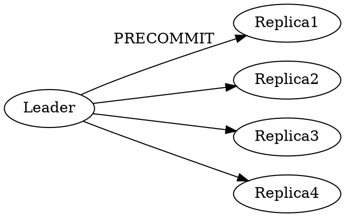

* 
{:toc}

## 1. 前言

HotStuff提出了一个三阶段投票的BFT类共识协议，该协议实现了safety、liveness、responsiveness特性。通过在投票过程中引入门限签名实现了$O(n)$的消息验证复杂度。Hotstuff总结出对比了目前主流的BFT共识协议，构建了基于经典BFT共识实现pipeline BFT共识的模式。

HotStuff是基于View的的共识协议，View表示一个共识单元，共识过程是由一个接一个的View组成。在一个View中，存在一个确定Leader来主导共识协议，并经过三阶段投票达成共识，然后切换到下一个View继续进行共识。假如遇到异常状况，某个View超时未能达成共识，也是切换到下一个View继续进行共识。

Basic hotStuff基础版本的共识协议，一个区块的确认需要三阶段投票达成后再进入下一个区块的共识。pipeline hotStuff是流水线的共识协议，提高了共识的效率。

## 2. 协议内容

### 2.1. 协议基础

#### 2.1.1. 名词解释

* BFT: 全称是Byzantine Fault tolerance， 表示系统可以容纳任意类型的错误，包括宕机、作恶等等
* SMR: 全称是State Machine Replication， 一个状态机系统，系统的每个节点都有着相同的状态副本
* BFT SMR protocol: 用来保证SMR中的各个正常节点都按照相同的顺序执行命令的一套协议
* View: 表示一个共识单元，共识过程是由一个接一个的View组成的，每个View中都有一个ViewNumber表示，每个ViewNumber对应一个Leader
* QC(quorum certificate): 表示一个被$(n-f)$个节点签名确认的数据包及viewNumber。比如，对某个区块的$(n-f)$个投票集合。
* prepareQC: 对于某个prepare消息，Leader收集齐$(n-f)$个节点签名所生成的证据（聚合签名或者是消息集合），可以视为第一轮投票达成的证据
* lockedQC: 对于某个precommit消息，Leader收集齐$(n-f)$个节点签名所生成的证据（聚合签名或者是消息集合），可以视为第二轮投票达成的证据。

#### 2.1.2. 副本状态机 | State Machine Replication

副本状态机（SMR, State Machine Replication）指的是状态机由多个副本组成，在执行命令时，各个副本上的状态通过共识达成一致。

假如各个副本的初始状态是一致的，那么通过共识机制使得输入命令的顺序达成全局一致，就可以实现各个副本上状态的一致。

在SMR中，存在一个Leader节点发送proposal，然后各个节点参与投票达成共识。

系统输入为tx，网络节点负责将这些tx，打包成一个block，每个block都包含其父block的哈希索引。

#### 2.1.3. 网络假设

在实际的分布式系统中，由于网络延时、分区等因素，系统不是同步的系统。

在异步的网络系统，由FLP原理可知，各个节点不可能达成共识，因此对于分布式系统的分析，一般是基于部分同步假设的。

* 同步（synchrony）：正常节点发出的消息，在已知的时间间隔内可以送达目标节点，即最大消息延迟是确定。
* 异步（asynchrony）：正常节点发出消息，在一个时间间隔内可以送达目标节点，但是该时间间隔未知，即最大消息延迟未知。
* 部分同步（partially synchrony）: 系统存在一个不确定的GST（global stable time）和一个$\Delta$，使得在GST结束后的$\Delta$时间内，系统处于一个同步状态。

### 2.2. basic HotStuff 三阶段流程

#### 2.2.1. Prepare阶段

每个View开始时，新的Leader收集由$(n-f)$个副本节点发送的**NEW-VIEW**消息，每个**NEW-VIEW**消息中包含了发送节点上高度最高的prepareQC(如果没有则设为空)。

> prepareQC可以看做是对于某个区块$(n-f)$个节点的投票集合，共识共识过程中第一轮投票达成的证据

Leader从收到的NewView消息中，选取高度最高的*preparedQC*作为*highQC*。因为*highQC*是viewNumber最大的，所以不会有比它更高的区块得到确认，该区块所在的分支是安全的。

下图是Leader节点本地的区块树， **\#71**是Leader节点收到的*highQC*, 那么阴影所表示的分支就是一个安全分支，基于该分支创建新的区块不会产生冲突。

Leader节点会在highQC所在的安全分支来创建一个新的区块，并广播proposal，proposal中包含了新的区块和*highQC*，其中*highQC*作为proposal的安全性验证。

其他节点（replica）一旦收到当前View对应Leader的Proposal消息，Replica会根据会safeNode-predicate规则检查Proposal是否合法。如果Proposal合法，Replica会向Leader发送一个Prepare-vote（根据自己私钥份额对Proposal的签名）。

Replica对于Proposal的验证遵循如下的规则:
1).  Proposal消息中的区块是从本机lockQC的区块扩展产生（即m.block是lockQC.block的子孙区块）
2).  为了保证liveness, 除了上一条之外，当Proposal.highQC高于本地lockQC中的view_number时也会接收该proposal。

safety判断规则对比的是lockQC，而不是第一轮投票的结果，所以即使在上一轮针对A投了prepare票，假如A没有commit，那么下一轮依然可以对A'投票，所以说第一轮投票可以反悔。

#### 2.2.2. Precommit

Leader发出proposal消息以后，等待$(n-f)$个节点对于该proposal的签名，集齐签名后会将这些签名组合成一个新的签名，以生成*prepare-QC*保存在本地，然后将其放入PRECOMMIT消息中广播给Replica节点。

***prepare-QC*可以表明有$(n-f)$个节点对相应的proposal进行了签名确认。**

* 在PBFT、Tendermint中，签名（投票）消息是节点间相互广播，各个节点都要做投票收集工作，所以对于每轮投票，Replica都需要至少验证$(n-f)$个签名。

* 在HotStuff中引入了阈值签名方案，Replica利用各自的私钥份额签名，由Leader收集签名，Replica只需要将签名消息发送给Leader就可以。Leader将Replica的签名组装后，广播给Replica。这样HotStuff的一轮投票每个Replica只需要验证一次签名。

* 在HotStuff中，一轮投票的过程，是通过replica与Leader的交互完成
    + replica收到proposal，对其签名后，发送给Leader
    + Leader集齐签名（投票）后，将签名（投票）组装，广播precommit消息
    + replica收到Precommit，验证其中签名，验证通过则表示第一轮投票成功。

**LibraBFT是基于hotStuff的共识协议，但是并没有采用hotStuff中的阈值签名方案**

当Replica收到Precommit消息时，会对其签名，然后回复给leader。

#### 2.2.3. Commit

commit阶段与precommit阶段类似，也是Leader先收集(n-f)个precommit-vote，然后将其组合为precommit-QC,并将其放在COMMIT消息中广播。

当Leader收到当前Proposal的（n-f）个precommit-vote时，会将这些投票组合成*precommit-QC*，然后将其放入COMMIT消息中广播。

当Replica收到COMMIT消息时，会对其签名commit-vote，然后回复给leader。更为重要的是，在此时，replica锁定在precommitQC上，将本地的lockQC更新成收到的precommitQC.

* 从Replica发出precommit-vote到Leader集齐消息并发出commit消息，这个过程相当于pbft、tendermint中的第二轮投票。
* Replica收到了commit消息，验证成功后，表示第二轮投票达成。此时Replica回复给Leader，并且保存precommitQC到lockedQC.

#### 2.2.4. Decide

当Leader收到了（n-f）个commit-vote投票，将他们组合成commitQC，广播DECIDE消息。

Replica收到DECIDE消息中的commitQC后，认为当前proposal是一个确定的消息，然后执行已经确定的分支上的tx。Viewnumber加1，开始新的阶段。

* Note: 这里也是针对输入做共识，共识后再执行已经确定共识分支上的交易。

### 2.3. Safety

#### 2.3.1. Safety性证明

##### 2.3.1.1. 同一个View下，不会对冲突的区块，产生相同类型的QC

证明思路： 反证法，假如在同一个view下，产生了相同类型的QC，而且最多存在f个作恶节点，那么就会有一个诚实节点双投了，这与前提假设矛盾。

* **Lemma１**：　对于任意两个有效的$qc_1$、$qc_2$，假如$qc_1.type == qc_2.type$，且$qc_1.block$与$qc_2.block$冲突，那么必然有$qc_1.viewNumber != qc_2.viewNumber$.

证明（反证法）：

假设$qc_1.viewNumber == qc_2.viewNumber$

那么，在相同的view中，有$2f+1$个replica对$qc_1.block$进行签名投票，同样有$2f+1$对$qc_2.block$投票，这样的话，就存在一个正常节点在算法流程中投了针对某个消息投了两票，这与算法流程冲突。

##### 2.3.1.2. 正常Replica不会commit冲突的区块

证明思路： 反证法，假如正常节点commit了冲突的区块，我们追踪到最早出现的冲突区块的位置，则这个冲突的位置肯定与两条safety规则相矛盾。

证明：

    1. 根据**Lemma1**，　在相同的view下，正常的replica不会对冲突的区块产生commitQC，所以不会commit冲突的区块。
    2. 下面证明在不同的view下，正常的replica也不会对冲突的区块产生commit

    证明（反证法）：
    
    假设viewNumber在v1和v2时（v1 < v2），commit了冲突的区块，即存在commitQC_1 = {block1, v1}, commitQC_2={block2, v2}，且block1与block2冲突。为了简化证明，我们同时假设v1与v2之间不存在其他的commitQC了，即commitQC_2是commit_1之后的第一个commitQC.

    在v1和v2之间,肯定存在一个最小的v_s(v1 < v_s <= v2)，使得v_s下存在有效的prepareQC_s{block_s, v_s},其中block_s与block1冲突.

    当含有block_s的prepare被广播后，节点会对该消息做safety验证，由于block_s与block1冲突，所以显然，不符合safety规则1.

    那么是否会符合规则2呢？
    假如block_s.parent.viewNumber > block_1.viewNumber，那么显然block_s.parent与block_1冲突，所以block_s.parent是更早的与block1冲突的，这与v_s最小矛盾。

    有2f+1个节点对于block_s的prepare消息投了票,那么这些节点在收到Prepare_s时,会进行safeNode验证,正常情况下,由于block_s与block1冲突,那么正常节点不会投出prepare_vote票,故而根本不会产生prepareQC_s, v_s根本不会存在. 这与上述假定冲突,因此在不同的view下,不可能对相同的block产生commit.

### 2.4. chained hotStuff

在basic hotStuff中，三阶段投票每一阶段无非都是发出消息然后收集投票，那么可以使用如下的方式简化协议。

在Prepare阶段的投票由当前view对应的leader1收集，集齐后生成prepareQC。然后将prepareQC发送到下一个view的leader2那里，leader2基于prepareQC开始新的prepare阶段，这是leader2的prepare阶段，同时也是leader1的precommit阶段。以此类推，leader2产生新的prepareQC,然后发送给下一个view的leader3，leader3开始自己的prepare阶段，同时也是leader1的commit阶段、leader2的precommit阶段。

协议简化为如下过程：

* Leader节点
    + 等待NewView消息，然后发出Proposal
    + 发出Proposal后，等待其他节点的投票
    + 向下一个Leader发出NewView消息
* 非Leader节点
    + 等待来自Leader的Proposal消息
    + 收到Leader的Proposal消息后，检查消息中的QC，更新本地的prepareQC、lockedQC等变量，发出投票
    + 向下一Leader发出NewView消息

#### 2.4.1. Dummy block

正常情况下，每个View中都有一个区块产生并集齐签名，但是情况不会总是这么完美，有时不会有新的区块产生。为了保持区块高度与viewNumber的一致，hotStuff中引入了*Dummy block*的概念。假如在一个View中，不能达成共识，那么就在为该View添加一个*Dummy block*。

#### 2.4.2. k-chain

一个区块中的QC是对其直接父区块的确认，那么我们称之为1-chain。同理，一个区块b后面没有*Dummy block*的情况下，连续产生了k个区块，则称这段区块链分支是对区块b的k-chain。

如果b'对b形成了1-chain，那么b'相当于b的prepare阶段达成（第一轮投票成功），节点会将本地的prepareQC更新。

每当一个新的区块形成，节点都会检查是否会形成1-chain，2-chian，3-chain.

* 1-chain: 有新的prepareQC形成，更新本地的prepareQC
* 2-chain: 有新的precommitQC形成，更新本地的lockedQC
* 3-chian: 有新的commitQC形成，有新的区块分支进入commit状态，执行确认的区块分支

#### 2.4.3. Pacemaker

把hotstuff抽象成一个事件驱动的协议，可以将liveness相关的功能抽离出来，成为单独的pacemaker模块。safety与liveness在实现上解耦，safety是协议的核心保证安全性，liveness由pacemaker保证。

* Pacemaker实现如下几部分功能
    + Leader检查
    + 收集NewView消息，对齐View并更新highQC

## 3. Q&A

* BFT类共识算法研究对比： PBFT - Tendermint - hosStuff - Casper - GRANDPA

    + PBFT： 两阶段投票，每个view有超时，viewchange通过一轮投票来完成，viewchange消息中包含了prepared消息（即达成了第一阶段投票的消息）。
    + Tendermint: 两阶段投票，一个round中的各个阶段都有超时时间，roundchange通过超时触发（而不是投票），网络节点保存自己已经达成第一阶段投票的消息（即polka消息）。
    + hotStuff: 三阶段投票，每个view有超时，采用阈值签名减小消息复杂度。liveness与safety解耦为两个部分
    + GRANDPA: 将出块与共识确认分离，用来对已经产生的区块链进行投票确认，两阶段投票，但是投票是针对区块分支（对一个区块投票也相当于对其所有父区块投票），而不是特定区块，各个节点可以针对不同高度的区块投票

* 第三阶段投票的意义?(对比pbft、tendermint)
    - 表面上看，第三轮投票是为了在确认大多数节点(2f+1)达成前两轮投票后，再发出NewView消息。这是为了通过用一轮投票来保证大多数节点都可以进入下一个高度，**通过一轮投票让各个节点保持视图对齐**。

    - 反过来看，假如去掉第三轮投票，达成第二轮投票后就发出NewView消息，会出现各个节点步调不一致，如果新的Leader自身运行的慢一点，第二轮投票还没有达成，那么收到NewView时，校验时会通不过。（但是通过几轮超时切换，共识流程依然会正常进行）
    
    - 我认为，假如没有第三阶段，不会影响节点的liveness和safety特性。
    
    - 在PBFT中的view change也是通过一轮投票实现的，与hotstuff中一样，只是pbft中只有在leader不能工作时候才会启动view change，在hotstuff中每个区块都会切换leader。加入pbft也是每次都切换Leader，那么pbft算上view change的话，也是三阶段投票。

    - 在tendermint中，视图切换没有通过投票来完成，而是通过固定的时间间隔来实现的，即使集齐了两轮投票也需要等待本轮view的时间耗尽才会进入下一个view，通过时间的等待，确保节点的视图对齐。tendermint这样的优点是少了一轮投票，但是牺牲了responsiveness。responsiveness指的是一个区块被leader发出后，到达成共识的时间间隔只与实际的网络延时有关。而Tendermint中，即使网络状态完好，依然需要等待6秒左右的时间才能达成共识。hotstuff使用一轮投票，保持了responsive特性。
    
* 达成第二阶段投票后，区块就不可逆转了，假如在此时执行交易是否有问题？
    - 我认为可以，但是会造成各个节点的临时状态新旧不一，而放在第三阶段投票后执行，可以保证大多数节点的状态一致性，与视图对齐的效果差不多。

* 相比于Tendermint, NewView消息的意义是什么？
    + NewView消息中包含了Replica节点的prepareQC，这可以保证,新的Leader能够基于全局最新状态进行下一轮共识（而不是只根据自己本地的状态）。
        - hotStuff新区块不是在已经commit的区块上添加，而是在highQC所在的安全分支上添加新区块，所以NewView消息是有必要的，否则会广播冲突或者无效的prepare。
        - 在Tendermint中，新的Leader可能是不知道其他节点存在锁定的区块，所以只根据节点本地的状态打包新的区块，这可能造成不同节点锁定在不同区块上。而为了保证Liveness，又引入了解锁机制（Istanbul中也采用了类似的解锁方案）。

* **Responsiveness**: block的确认时间，只取决于网络的实际延时，而不是取决于某个预先确定的时间限制。
    + Tendermint在网络正常情况下，也是6秒左右一个块
    + hotStuff中区块的确认时间只与实际的网络延迟有关

* Responsiveness在区块链的世界中是否重要？

